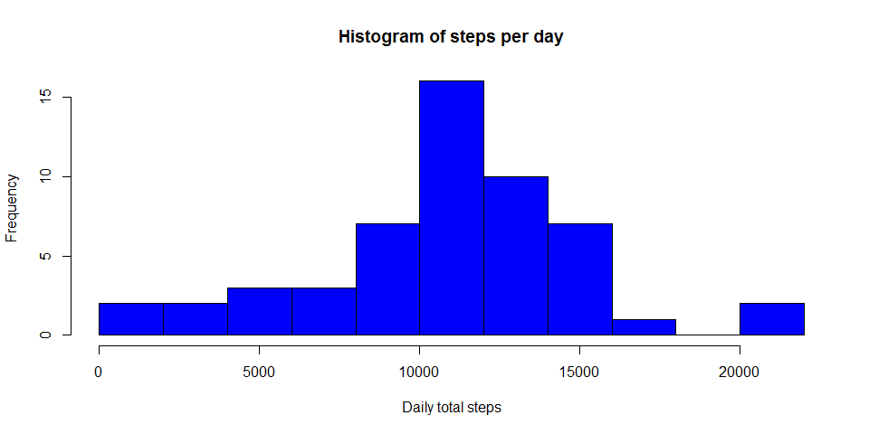
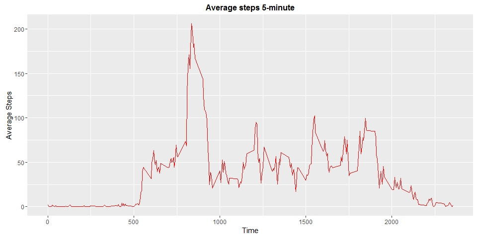
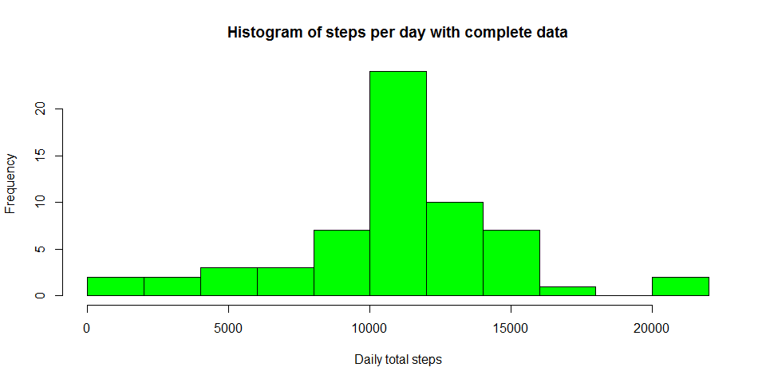
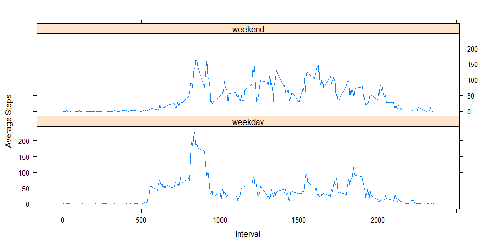

# Reproducible Research: Peer Assessment 1

**Name** - *Rinosh Polavarapu*  
**Submission** - *Course Project1 - Reproducible Research*  

## Loading and preprocessing the data
*Show any code that is needed to*  
*1. Load the data (i.e. read.csv())*   
*2. Process/transform the data (if necessary) into a format suitable for your analysis*   


```r
activity_data <- read.csv("activity.csv")
library(ggplot2)
library(lattice)
str(activity_data)
```

```
## 'data.frame':	17568 obs. of  3 variables:
##  $ steps   : int  NA NA NA NA NA NA NA NA NA NA ...
##  $ date    : Factor w/ 61 levels "2012-10-01","2012-10-02",..: 1 1 1 1 1 1 1 1 1 1 ...
##  $ interval: int  0 5 10 15 20 25 30 35 40 45 ...
```

```r
# Characters in the data column has been converted as Date class objects
activity_data$date <- as.Date(activity_data$date)
#To create data set without NA 
activity_NAlessdata <- subset(activity_data, !is.na(activity_data$steps))
```

As we can see, the variables included in activity_data dataset are:   
1. **steps**: Number of steps taking in a 5-minute interval (missing values are coded as NA)  
2. **date**: The date on which the measurement was taken in YYYY-MM-DD format   
3. **interval**: Identifier for the 5-minute interval in which measurement was taken   

<br>


## What is mean total number of steps taken per day?

*For this part of the assignment, you can ignore the missing values in the dataset.*    
*1. Calculate the total number of steps taken per day*    
*2. Make a histogram of the total number of steps taken each day*    
*3. Calculate and report the mean and median total number of steps taken per day*    

###**1. Number of steps per day**


```r
Steps_per_day <- aggregate(activity_data$steps, list(activity_data$date), FUN=sum)
colnames(Steps_per_day) <- c("Date", "Steps")
Steps_per_day
```

```
##          Date Steps
## 1  2012-10-01    NA
## 2  2012-10-02   126
## 3  2012-10-03 11352
## 4  2012-10-04 12116
## 5  2012-10-05 13294
## 6  2012-10-06 15420
## 7  2012-10-07 11015
## 8  2012-10-08    NA
## 9  2012-10-09 12811
## 10 2012-10-10  9900
## 11 2012-10-11 10304
## 12 2012-10-12 17382
## 13 2012-10-13 12426
## 14 2012-10-14 15098
## 15 2012-10-15 10139
## 16 2012-10-16 15084
## 17 2012-10-17 13452
## 18 2012-10-18 10056
## 19 2012-10-19 11829
## 20 2012-10-20 10395
## 21 2012-10-21  8821
## 22 2012-10-22 13460
## 23 2012-10-23  8918
## 24 2012-10-24  8355
## 25 2012-10-25  2492
## 26 2012-10-26  6778
## 27 2012-10-27 10119
## 28 2012-10-28 11458
## 29 2012-10-29  5018
## 30 2012-10-30  9819
## 31 2012-10-31 15414
## 32 2012-11-01    NA
## 33 2012-11-02 10600
## 34 2012-11-03 10571
## 35 2012-11-04    NA
## 36 2012-11-05 10439
## 37 2012-11-06  8334
## 38 2012-11-07 12883
## 39 2012-11-08  3219
## 40 2012-11-09    NA
## 41 2012-11-10    NA
## 42 2012-11-11 12608
## 43 2012-11-12 10765
## 44 2012-11-13  7336
## 45 2012-11-14    NA
## 46 2012-11-15    41
## 47 2012-11-16  5441
## 48 2012-11-17 14339
## 49 2012-11-18 15110
## 50 2012-11-19  8841
## 51 2012-11-20  4472
## 52 2012-11-21 12787
## 53 2012-11-22 20427
## 54 2012-11-23 21194
## 55 2012-11-24 14478
## 56 2012-11-25 11834
## 57 2012-11-26 11162
## 58 2012-11-27 13646
## 59 2012-11-28 10183
## 60 2012-11-29  7047
## 61 2012-11-30    NA
```
###**2. Histogram of the total number of steps taken each day**


```r
steps_sum <- tapply(activity_NAlessdata$steps, activity_NAlessdata$date, sum, na.rm=TRUE)
hist(x=steps_sum,
     col="blue",
     breaks=15,
     xlab="Daily total steps",
     ylab="Frequency",
     main="Histogram of steps per day")
```

<!-- -->


###**3. Mean and median of total number of steps taken per day**


```r
mean(Steps_per_day$Steps, na.rm=TRUE)
```

```
## [1] 10766.19
```

```r
median(Steps_per_day$Steps, na.rm=TRUE)
```

```
## [1] 10765
```

## What is the average daily activity pattern?

*1. Make a time series plot (i.e. type = "l") of the 5-minute interval (x-axis) and the   average number of steps taken, averaged across all days (y-axis)*     
*2. Which 5-minute interval, on average across all the days in the dataset, contains the    maximum number of steps?*   

###**1. Time series plot of the 5 minute interval (x) and averaged number of steps taken averaged across all days (y)**

```r
Steps_per_time <- aggregate(steps~interval,data=activity_data, FUN=mean,na.action=na.omit)
time_plot <- ggplot(Steps_per_time, aes(interval, steps))
time_plot+geom_line(col="red")+ggtitle("Average steps 5-minute")+xlab("Time")+ylab("Average Steps")+theme(plot.title = element_text(face="bold", size=12))
```

<!-- -->

###**2. 5-minute interval (on average across all the days) with the maximum number of steps**

```r
steps_avg <- tapply(activity_NAlessdata$steps, activity_NAlessdata$interval, mean, na.rm=TRUE, simplify=T)
activity_avg <- data.frame(interval=as.integer(names(steps_avg)), avg=steps_avg)
max_steps <- max(activity_avg$avg)
activity_avg[activity_avg$avg == max_steps,]
```

```
##     interval      avg
## 835      835 206.1698
```


## Imputing missing values

*Note that there are a number of days/intervals where there are missing values (coded as NA). The presence of missing days may introduce bias into some calculations or summaries of the data.**     
**1. Calculate and report the total number of missing values in the dataset (i.e. the total number of rows with NAs)*     
*2. Devise a strategy for filling in all of the missing values in the dataset. The strategy does not need to be sophisticated. For example, you could use the mean/median for that day, or the mean for that 5-minute interval, etc.*    
*3. Create a new dataset that is equal to the original dataset but with the missing data filled in.*    
*4. Make a histogram of the total number of steps taken each day and Calculate and report the mean and median total number of steps taken per day. Do these values differ from the estimates from the first part of the assignment? What is the impact of imputing missing data on the estimates of the total daily number of steps?*     

###**1. Total number of missing values in the dataset**


```r
sum(is.na(activity_data$steps))
```

```
## [1] 2304
```

###**2 & 3. Replace missing values by using mean of the 5-minute interval and create a new dataset with no missing values**   

```r
activity_data_Imputed <- activity_data
steps_na <- is.na(activity_data_Imputed$steps)
steps_avg <- tapply(activity_NAlessdata$steps, activity_NAlessdata$interval, mean, na.rm= TRUE, simplify = T)
activity_data_Imputed$steps[steps_na] <- steps_avg[as.character(activity_data_Imputed$interval[steps_na])]
```

###**4A. Histogram of the total number of steps taken each day with missing data filled in**

```r
steps_sum_filled <- tapply(activity_data_Imputed$steps, activity_data_Imputed$date, sum, na.rm=TRUE)
hist(x=steps_sum_filled,
     col="green",
     breaks=15,
     xlab="Daily total steps",
     ylab="Frequency",
     main="Histogram of steps per day with complete data")
```

<!-- -->

###**4B. Calculate and report the mean and median total number of steps taken per day. Do these values differ from the estimates from the first part of the assignment? What is the impact of imputing missing data on the estimates of the total daily number of steps?** 


```r
Steps_per_day_filled <- aggregate(activity_data_Imputed$steps, list(activity_data_Imputed$date), FUN=sum)
colnames(Steps_per_day_filled) <- c("Date", "Steps")
mean(Steps_per_day_filled$Steps)
```

```
## [1] 10766.19
```

```r
median(Steps_per_day_filled$Steps)
```

```
## [1] 10766.19
```

The new mean  after filling empty cells is **10766** and the new median is **10766** . In comparison to the original **mean 10766** and **median 10765** , the mean **doesn't vary**, and the median becomes **identical** to the mean. Since I employed the method of using mean to fill the missing data for the intervals, all missing data is closer to mean and median is shifted towards the mean.

The impact of imputing missing data on the estimates of the total daily number of steps is also clear: now we have higher frquency counts in the histogram at the center region (close to the mean).


## Are there differences in activity patterns between weekdays and weekends?

*For this part the weekdays() function may be of some help here. Use the dataset with the filled-in missing values for this part.*    
*1. Create a new factor variable in the dataset with two levels - "weekday" and "weekend" indicating whether a given date is a weekday or weekend day.*    
*2. Make a panel plot containing a time series plot (i.e. type = "l") of the 5-minute interval (x-axis) and the average number of steps taken, averaged across all weekday days or weekend days (y-axis).*    

###**1. Create a new factor variable *day_type* in the dataset with two levels - "weekday" and "weekend" indicating whether a given date is a weekday or weekend day.** 


```r
activity_data_Imputed$RealDate <- as.Date(activity_data_Imputed$date, format = "%Y-%m-%d")
activity_data_Imputed$day <- weekdays(activity_data_Imputed$RealDate)
activity_data_Imputed$day_type <- ifelse(activity_data_Imputed$day=='Saturday' | activity_data_Imputed$day=='Sunday', 'weekend','weekday')
head(activity_data_Imputed, n=10)
```

```
##        steps       date interval   RealDate    day day_type
## 1  1.7169811 2012-10-01        0 2012-10-01 Monday  weekday
## 2  0.3396226 2012-10-01        5 2012-10-01 Monday  weekday
## 3  0.1320755 2012-10-01       10 2012-10-01 Monday  weekday
## 4  0.1509434 2012-10-01       15 2012-10-01 Monday  weekday
## 5  0.0754717 2012-10-01       20 2012-10-01 Monday  weekday
## 6  2.0943396 2012-10-01       25 2012-10-01 Monday  weekday
## 7  0.5283019 2012-10-01       30 2012-10-01 Monday  weekday
## 8  0.8679245 2012-10-01       35 2012-10-01 Monday  weekday
## 9  0.0000000 2012-10-01       40 2012-10-01 Monday  weekday
## 10 1.4716981 2012-10-01       45 2012-10-01 Monday  weekday
```

###**2. Two time series plot of the 5-minute interval (x) and the average number of steps taken averaged across weekday days or weekend days (y).** 


```r
steps_avg2 <- aggregate(steps~interval+day_type, data = activity_data_Imputed, FUN=mean, na.action=na.omit)
xyplot(steps ~ interval | factor(day_type),layout = c(1, 2), xlab="Interval",ylab="Average Steps", type="l", lty=1, data=steps_avg2)
```

<!-- -->


